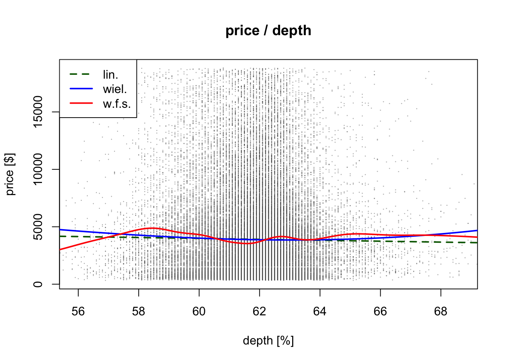
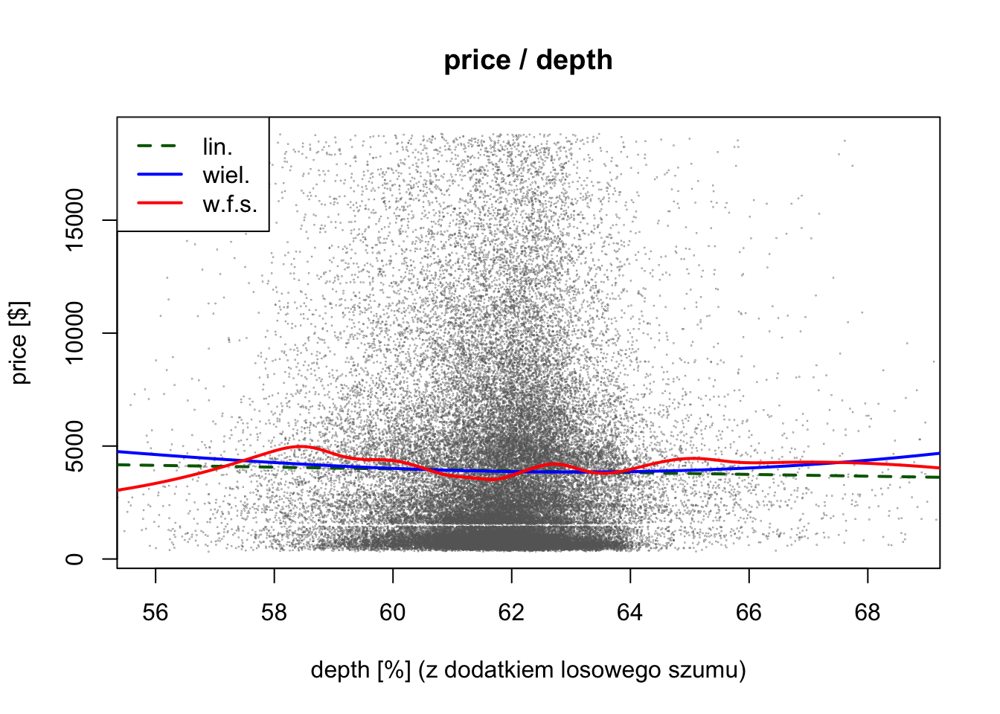
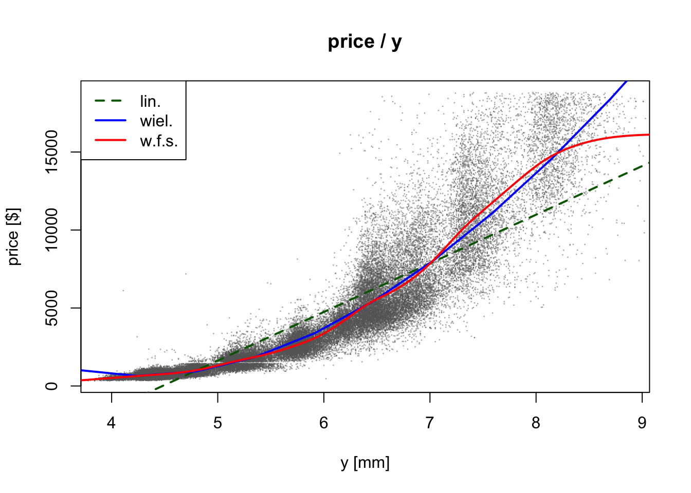
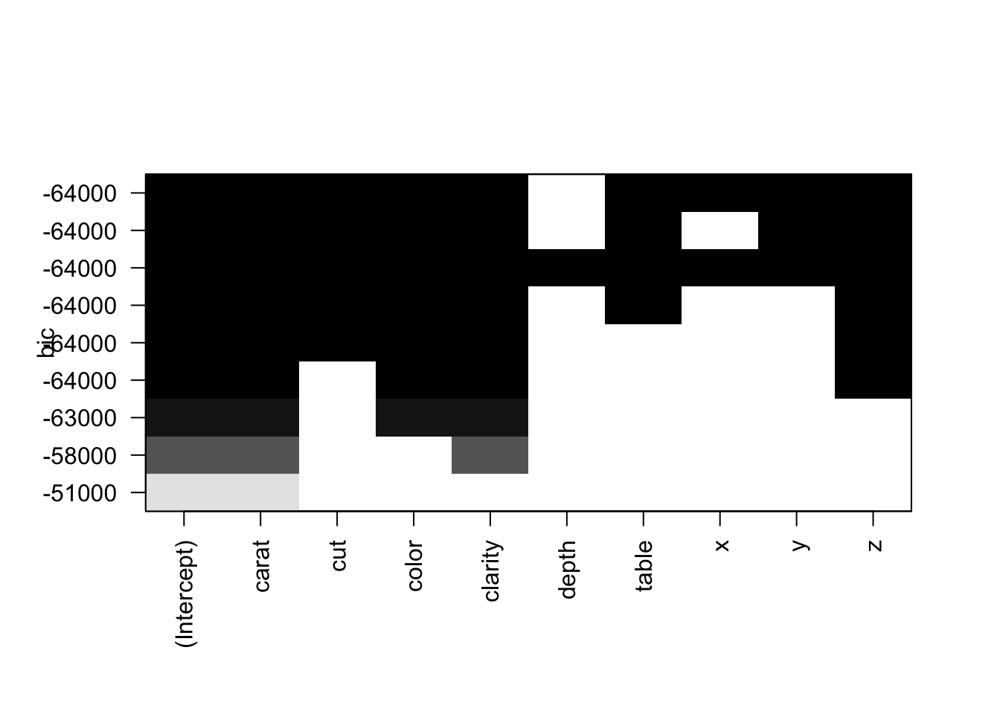

# Projekt na przedmiot Statystyka Wielowymiarowa na AGH

[Piotr Janczyk](https://github.com/pjanczyk), [Miłosz
Janowski](https://github.com/milekj)

Analiza zbioru danych
*diamonds*.

-----

## Zbiór danych

<https://github.com/vincentarelbundock/Rdatasets/blob/master/csv/ggplot2/diamonds.csv>

Cechy:

  - `price` — price in US dollars ($326–$18,823)
  - `carat` — weight of the diamond (0.2–5.01)
  - `cut` — quality of the cut (*Fair*, *Good*, *Very Good*, *Premium*,
    *Ideal*)
  - `color` — diamond colour, from *D* (best) to *J* (worst)
  - `clarity` — a measurement of how clear the diamond is (*I1* (worst),
    *SI2*, *SI1*, *VS2*, *VS1*, *VVS2*, *VVS1*, *IF* (best))
  - `x` — length in mm (0–10.74)
  - `y` — width in mm (0–58.9)
  - `z` — depth in mm (0–31.8)
  - `depth` — total depth percentage = `z / mean(x, y)` = `2 * z / (x +
    y)` (43–79)
  - `table` — width of top of diamond relative to widest point
(43–95)

<!-- end list -->

``` r
diamonds <- read.csv("diamonds.csv", header = TRUE, stringsAsFactors = TRUE)
str(diamonds)
```

    'data.frame':   53940 obs. of  11 variables:
     $ X      : int  1 2 3 4 5 6 7 8 9 10 ...
     $ carat  : num  0.23 0.21 0.23 0.29 0.31 0.24 0.24 0.26 0.22 0.23 ...
     $ cut    : Factor w/ 5 levels "Fair","Good",..: 3 4 2 4 2 5 5 5 1 5 ...
     $ color  : Factor w/ 7 levels "D","E","F","G",..: 2 2 2 6 7 7 6 5 2 5 ...
     $ clarity: Factor w/ 8 levels "I1","IF","SI1",..: 4 3 5 6 4 8 7 3 6 5 ...
     $ depth  : num  61.5 59.8 56.9 62.4 63.3 62.8 62.3 61.9 65.1 59.4 ...
     $ table  : num  55 61 65 58 58 57 57 55 61 61 ...
     $ price  : int  326 326 327 334 335 336 336 337 337 338 ...
     $ x      : num  3.95 3.89 4.05 4.2 4.34 3.94 3.95 4.07 3.87 4 ...
     $ y      : num  3.98 3.84 4.07 4.23 4.35 3.96 3.98 4.11 3.78 4.05 ...
     $ z      : num  2.43 2.31 2.31 2.63 2.75 2.48 2.47 2.53 2.49 2.39 ...

``` r
knitr::kable(head(diamonds))
```

| X | carat | cut       | color | clarity | depth | table | price |    x |    y |    z |
| -: | ----: | :-------- | :---- | :------ | ----: | ----: | ----: | ---: | ---: | ---: |
| 1 |  0.23 | Ideal     | E     | SI2     |  61.5 |    55 |   326 | 3.95 | 3.98 | 2.43 |
| 2 |  0.21 | Premium   | E     | SI1     |  59.8 |    61 |   326 | 3.89 | 3.84 | 2.31 |
| 3 |  0.23 | Good      | E     | VS1     |  56.9 |    65 |   327 | 4.05 | 4.07 | 2.31 |
| 4 |  0.29 | Premium   | I     | VS2     |  62.4 |    58 |   334 | 4.20 | 4.23 | 2.63 |
| 5 |  0.31 | Good      | J     | SI2     |  63.3 |    58 |   335 | 4.34 | 4.35 | 2.75 |
| 6 |  0.24 | Very Good | J     | VVS2    |  62.8 |    57 |   336 | 3.94 | 3.96 | 2.48 |

## Przygotowanie zbioru danych

``` r
# Usunięcie liczb porządkowych
diamonds$X <- NULL

# Odfitrowanie kilkunastu rekordów z brakującymi danymi
diamonds <- diamonds[diamonds$x > 0 & diamonds$y > 0 & diamonds$z > 0,]

# Posortowanie zmiennych typu factor
diamonds$color <- factor(diamonds$color,
                         levels = c("D", "E", "F", "G", "H", "I", "J"),
                         ordered = TRUE)

diamonds$clarity <- factor(diamonds$clarity,
                           levels = c("I1", "SI2", "SI1", "VS2", "VS1", "VVS2", "VVS1", "IF"),
                           ordered = TRUE)

diamonds$cut <- factor(diamonds$cut,
                       levels = c("Fair", "Good", "Very Good", "Premium", "Ideal"),
                       ordered = TRUE)

# Konwersja do zmiennych numerycznych
diamonds_num <- transform(diamonds,
                          color = as.numeric(color),
                          clarity = as.numeric(clarity),
                          cut = as.numeric(cut))
```

## Podział na zbiór treningowy i testowy

``` r
n <- nrow(diamonds)
train <- sample(1:n, n / 2)
test <- -train
```

# Pomocnicze funkcje

``` r
fancy_plot <- function (x, y, ...) {
  if (is.numeric(x)) {
    # Powiększenie danych na wykresie poprzez ukrycie daleko oddalonych skrajnych punktów
    xlim = quantile(x, c(0.001, 0.999))
    col = "#666666"
  } else {
    xlim = NULL
    col = "#cccccc"
  }

  plot(x = x, y = y, xlim = xlim, pch = 20, cex = 0.05, col = col, ...)
}
```

## Regresja jednokrotna

Regresja liniowa, regresja wielomianowa, wygładzające funkcje
sklejane

``` r
single_regression <- function (predictor, predictor_name, show_summary = FALSE) {
  fancy_plot(x = predictor, y = diamonds$price,
             main = sprintf("price / %s", predictor_name),
             xlab = predictor_name,
             ylab = "price ($)")
  
  predictor_num <- as.numeric(predictor)
  
  # Regresja liniowa
  linear_fit <- lm(diamonds$price ~ predictor_num, subset = train)
  abline(linear_fit, lwd = 2, col = "darkgreen", lty = 2)
  
  # Regresja wielomianowa
  poly_fit <- lm(diamonds$price ~ poly(predictor_num, 3), subset = train)
  grid <- seq(min(predictor_num), max(predictor_num), length.out = 100)
  lines(x = grid, y = predict(poly_fit, list(predictor_num = grid), se.fit = TRUE)$fit,
        lwd = 2, col = "blue")
  
  # Wygładzające funkcje sklejane
  spline_fit <- smooth.spline(predictor_num[train], diamonds$price[train], cv = TRUE)
  lines(spline_fit, col = "red", lwd = 2)
  
  legend("topleft",
         legend=c("lin.", "wiel.", "w.f.s."),
         col=c("darkgreen", "blue", "red"),
         lty=c(2, 1, 1),
         lwd = 2)
  
  linear_pred = predict(linear_fit, list(predictor_num = predictor_num[test]))
  poly_pred = predict(poly_fit, list(predictor_num = predictor_num[test]))
  linear_mse = mean((diamonds$price[test] - linear_pred) ^ 2)
  poly_mse = mean((diamonds$price[test] - poly_pred) ^ 2)
  
  print(knitr::kable(cbind(
    linear_mse = linear_mse,
    poly_mse = poly_mse)))
  
  if (show_summary) {
    print(summary(linear_fit))
    print(summary(poly_fit))
    print(summary(spline_fit))
  }
}

single_regression(diamonds$carat, "carat")
```


``` 


 linear_mse   poly_mse
-----------  ---------
    2406656    2155097
```

``` r
single_regression(diamonds$cut, "cut")
```


``` 


 linear_mse   poly_mse
-----------  ---------
   16036992   15897016
```

``` r
single_regression(diamonds$color, "color")
```


``` 


 linear_mse   poly_mse
-----------  ---------
   15592394   15575742
```

``` r
single_regression(diamonds$clarity, "clarity")
```


``` 


 linear_mse   poly_mse
-----------  ---------
   15737796   15736939
```

``` r
single_regression(diamonds$depth, "depth")
```



``` 


 linear_mse   poly_mse
-----------  ---------
   16084083   16070745
```

``` r
single_regression(diamonds$depth + runif(nrow(diamonds), -0.05, 0.05), "depth (with random noise)")
```



``` 


 linear_mse   poly_mse
-----------  ---------
   16084087   16070730
```

``` r
single_regression(diamonds$table, "table")
```


``` 


 linear_mse   poly_mse
-----------  ---------
   15824582   15768756
```

``` r
single_regression(as.factor(round(diamonds$table)), "table (rounded to nearest integer)")
```


``` 


 linear_mse   poly_mse
-----------  ---------
   15823397   15755301
```

``` r
single_regression(diamonds$x, "x", show_summary = TRUE)
```


``` 


 linear_mse   poly_mse
-----------  ---------
    3394256    2177609

Call:
lm(formula = diamonds$price ~ predictor_num, subset = train)

Residuals:
    Min      1Q  Median      3Q     Max 
-6891.8 -1265.2  -186.1   990.7 11159.2 

Coefficients:
               Estimate Std. Error t value Pr(>|t|)    
(Intercept)   -14172.44      58.67  -241.5   <2e-16 ***
predictor_num   3155.69      10.05   314.0   <2e-16 ***
---
Signif. codes:  0 '***' 0.001 '**' 0.01 '*' 0.05 '.' 0.1 ' ' 1

Residual standard error: 1837 on 26958 degrees of freedom
Multiple R-squared:  0.7853,    Adjusted R-squared:  0.7853 
F-statistic: 9.862e+04 on 1 and 26958 DF,  p-value: < 2.2e-16


Call:
lm(formula = diamonds$price ~ poly(predictor_num, 3), subset = train)

Residuals:
     Min       1Q   Median       3Q      Max 
-10283.4   -506.7    -24.9    345.8  11694.9 

Coefficients:
                          Estimate Std. Error t value Pr(>|t|)    
(Intercept)               3927.224      8.917  440.42   <2e-16 ***
poly(predictor_num, 3)1 820900.495   2082.161  394.25   <2e-16 ***
poly(predictor_num, 3)2 251281.347   2081.639  120.71   <2e-16 ***
poly(predictor_num, 3)3 -60151.922   2072.383  -29.02   <2e-16 ***
---
Signif. codes:  0 '***' 0.001 '**' 0.01 '*' 0.05 '.' 0.1 ' ' 1

Residual standard error: 1464 on 26956 degrees of freedom
Multiple R-squared:  0.8636,    Adjusted R-squared:  0.8636 
F-statistic: 5.689e+04 on 3 and 26956 DF,  p-value: < 2.2e-16

           Length Class             Mode   
x          524    -none-            numeric
y          524    -none-            numeric
w          524    -none-            numeric
yin        524    -none-            numeric
tol          1    -none-            numeric
data         3    -none-            list   
no.weights   1    -none-            logical
lev        524    -none-            numeric
cv.crit      1    -none-            numeric
pen.crit     1    -none-            numeric
crit         1    -none-            numeric
df           1    -none-            numeric
spar         1    -none-            numeric
ratio        1    -none-            numeric
lambda       1    -none-            numeric
iparms       5    -none-            numeric
auxM         0    -none-            NULL   
fit          5    smooth.spline.fit list   
call         4    -none-            call   
```

``` r
single_regression(diamonds$y, "y")
```



``` 


 linear_mse    poly_mse
-----------  ----------
    4278723   375194117
```

``` r
single_regression(diamonds$z, "z")
```


``` 


 linear_mse     poly_mse
-----------  -----------
    4316951   7972772041
```

## Regresja liniowa wielokrotna

``` r
lm_fit <- lm(price ~ ., data = diamonds_num, subset = train)
summary(lm_fit)
```

``` 

Call:
lm(formula = price ~ ., data = diamonds_num, subset = train)

Residuals:
     Min       1Q   Median       3Q      Max 
-23967.4   -615.3   -119.0    478.0   8932.5 

Coefficients:
             Estimate Std. Error t value Pr(>|t|)    
(Intercept)   830.233    947.184   0.877    0.381    
carat       11073.924     78.080 141.827  < 2e-16 ***
cut           109.179      8.015  13.621  < 2e-16 ***
color        -323.998      4.564 -70.983  < 2e-16 ***
clarity       498.578      4.957 100.579  < 2e-16 ***
depth           7.857     14.035   0.560    0.576    
table         -31.794      4.152  -7.658 1.95e-14 ***
x            -230.634    122.161  -1.888    0.059 .  
y             312.751     48.318   6.473 9.78e-11 ***
z           -1736.836    220.890  -7.863 3.89e-15 ***
---
Signif. codes:  0 '***' 0.001 '**' 0.01 '*' 0.05 '.' 0.1 ' ' 1

Residual standard error: 1205 on 26950 degrees of freedom
Multiple R-squared:  0.9076,    Adjusted R-squared:  0.9075 
F-statistic: 2.94e+04 on 9 and 26950 DF,  p-value: < 2.2e-16
```

``` r
lm_pred <- predict(lm_fit, diamonds_num[test,])

lm_mse <- mean((diamonds_num$price[test] - lm_pred) ^ 2)
lm_mse
```

    [1] 1589148

## Wybór najlepszego podzbioru cech

``` r
library(leaps)
bs_fit <- regsubsets(price ~ ., data = diamonds_num, nvmax = Inf)
bs_fit_summary <- summary(bs_fit)
bs_fit_summary
```

    Subset selection object
    Call: regsubsets.formula(price ~ ., data = diamonds_num, nvmax = Inf)
    9 Variables  (and intercept)
            Forced in Forced out
    carat       FALSE      FALSE
    cut         FALSE      FALSE
    color       FALSE      FALSE
    clarity     FALSE      FALSE
    depth       FALSE      FALSE
    table       FALSE      FALSE
    x           FALSE      FALSE
    y           FALSE      FALSE
    z           FALSE      FALSE
    1 subsets of each size up to 9
    Selection Algorithm: exhaustive
             carat cut color clarity depth table x   y   z  
    1  ( 1 ) "*"   " " " "   " "     " "   " "   " " " " " "
    2  ( 1 ) "*"   " " " "   "*"     " "   " "   " " " " " "
    3  ( 1 ) "*"   " " "*"   "*"     " "   " "   " " " " " "
    4  ( 1 ) "*"   " " "*"   "*"     " "   " "   "*" " " " "
    5  ( 1 ) "*"   "*" "*"   "*"     " "   " "   "*" " " " "
    6  ( 1 ) "*"   "*" "*"   "*"     "*"   " "   "*" " " " "
    7  ( 1 ) "*"   "*" "*"   "*"     "*"   "*"   "*" " " " "
    8  ( 1 ) "*"   "*" "*"   "*"     "*"   "*"   "*" "*" " "
    9  ( 1 ) "*"   "*" "*"   "*"     "*"   "*"   "*" "*" "*"

#### Kryterium BIC

``` r
plot(bs_fit, scale = 'bic')
```



#### Przy pomocy metody zbioru walidacyjnego

``` r
predict.regsubsets <- function(object, newdata, id, ...) {
  model.formula <- as.formula(object$call[[2]])
  mat <- model.matrix(model.formula, newdata)
  coefs <- coef(object, id = id)
  mat[, names(coefs)] %*% coefs
}

bs_mse <- sapply(1:9, function(i) {
  pred <- predict(bs_fit, diamonds_num[test,], id = i)
  mean((diamonds_num$price[test] - pred) ^ 2)
})
bs_mse
```

    [1] 2406346 1834714 1570887 1537923 1504410 1497191 1495486 1495472 1495489

``` r
plot(bs_mse, 
     xlab = "Liczba zmiennych", ylab = "MSE",
     col = "black", type = "b", pch = 20)
points(which.min(bs_mse), min(bs_mse), col = "red", pch = 9)
```


## Drzewo decyzyjne

``` r
library(tree)
Cost <- factor(ifelse(diamonds$price <= 1000, "Cheap", ifelse(diamonds$price <= 10000, "Moderate", "Expansive")))
diamondsE <- data.frame(diamonds_num, Cost)

diamonds.tree <- tree(Cost ~ . - price, data = diamondsE, subset = train)
plot(diamonds.tree)
text(diamonds.tree, pretty = 0)
```


``` r
summary(diamonds.tree)
```

``` 

Classification tree:
tree(formula = Cost ~ . - price, data = diamondsE, subset = train)
Variables actually used in tree construction:
[1] "x"       "clarity" "y"      
Number of terminal nodes:  8 
Residual mean deviance:  0.4617 = 12440 / 26950 
Misclassification error rate: 0.09518 = 2566 / 26960 
```

``` r
tree.class <- predict(diamonds.tree, newdata = diamondsE[test,], type = "class")
table(tree.class, diamondsE$Cost[test])
```

``` 
           
tree.class  Cheap Expansive Moderate
  Cheap      6678         0      547
  Expansive     0      2217      905
  Moderate    691       428    15494
```

``` r
mean(tree.class != diamondsE$Cost[test])
```

    [1] 0.0953635

## Regresja logistyczna GAM

``` r
library(gam)
fit.gam.bf <- gam(I(price > 10000) ~ s(table, df = 5) + cut + clarity + color, data = diamonds, family = binomial)
summary(fit.gam.bf)
```

``` 

Call: gam(formula = I(price > 10000) ~ s(table, df = 5) + cut + clarity + 
    color, family = binomial, data = diamonds)
Deviance Residuals:
    Min      1Q  Median      3Q     Max 
-0.8427 -0.4934 -0.4038 -0.3313  2.9847 

(Dispersion Parameter for binomial family taken to be 1)

    Null Deviance: 34268.14 on 53919 degrees of freedom
Residual Deviance: 32957.78 on 53897 degrees of freedom
AIC: 33003.78 

Number of Local Scoring Iterations: 6 

Anova for Parametric Effects
                    Df Sum Sq Mean Sq F value    Pr(>F)    
s(table, df = 5)     1    213 212.813 211.615 < 2.2e-16 ***
cut                  4     81  20.335  20.221 < 2.2e-16 ***
clarity              7    175  25.012  24.871 < 2.2e-16 ***
color                6    660 110.068 109.448 < 2.2e-16 ***
Residuals        53897  54202   1.006                      
---
Signif. codes:  0 '***' 0.001 '**' 0.01 '*' 0.05 '.' 0.1 ' ' 1

Anova for Nonparametric Effects
                 Npar Df Npar Chisq    P(Chi)    
(Intercept)                                      
s(table, df = 5)       4     80.691 < 2.2e-16 ***
cut                                              
clarity                                          
color                                            
---
Signif. codes:  0 '***' 0.001 '**' 0.01 '*' 0.05 '.' 0.1 ' ' 1
```

``` r
#par(mfrow = c(1,4))
plot(fit.gam.bf, col = "red")
```


